# Execution Plan — TODO List App

## Detailed Analysis Summary

### Change Impact Assessment
- **User-facing changes**: Yes — full web UI with auth flows, task management, filtering, search
- **Structural changes**: Yes — new full-stack architecture (frontend + backend API + database)
- **Data model changes**: Yes — new schemas: User, Task, Category/Tag, Session
- **API changes**: Yes — new REST API with authentication-protected endpoints
- **NFR impact**: Yes — security (full enforcement), PBT (full enforcement), performance targets, accessibility

### Risk Assessment
- **Risk Level**: Medium
- **Rollback Complexity**: Moderate (multiple layers: frontend, backend, DB schema)
- **Testing Complexity**: Moderate-to-High (auth flows, IDOR prevention, filtering logic, PBT)
- **Key Risks**:
  - Auth implementation correctness (IDOR vulnerabilities, session security)
  - Database query performance as task list scales
  - PBT coverage for stateful task operations

---

## Workflow Visualization

```mermaid
flowchart TD
    Start(["TODO List App"])

    subgraph INCEPTION["🔵 INCEPTION PHASE"]
        WD["Workspace Detection<br/><b>COMPLETED</b>"]
        RA["Requirements Analysis<br/><b>COMPLETED</b>"]
        US["User Stories<br/><b>EXECUTE</b>"]
        WP["Workflow Planning<br/><b>COMPLETED</b>"]
        AD["Application Design<br/><b>EXECUTE</b>"]
        UG["Units Generation<br/><b>EXECUTE</b>"]
    end

    subgraph CONSTRUCTION["🟢 CONSTRUCTION PHASE"]
        FD["Functional Design<br/><b>EXECUTE per unit</b>"]
        NFRA["NFR Requirements<br/><b>EXECUTE per unit</b>"]
        NFRD["NFR Design<br/><b>EXECUTE per unit</b>"]
        ID["Infrastructure Design<br/><b>EXECUTE per unit</b>"]
        CG["Code Generation<br/><b>EXECUTE per unit</b>"]
        BT["Build and Test<br/><b>EXECUTE</b>"]
    end

    subgraph OPERATIONS["🟡 OPERATIONS PHASE"]
        OPS["Operations<br/><b>PLACEHOLDER</b>"]
    end

    Start --> WD
    WD --> RA
    RA --> US
    US --> WP
    WP --> AD
    AD --> UG
    UG --> FD
    FD --> NFRA
    NFRA --> NFRD
    NFRD --> ID
    ID --> CG
    CG -.->|Next Unit| FD
    CG --> BT
    BT -.-> OPS
    BT --> End(["Complete"])

    style WD fill:#4CAF50,stroke:#1B5E20,stroke-width:3px,color:#fff
    style RA fill:#4CAF50,stroke:#1B5E20,stroke-width:3px,color:#fff
    style WP fill:#4CAF50,stroke:#1B5E20,stroke-width:3px,color:#fff
    style CG fill:#4CAF50,stroke:#1B5E20,stroke-width:3px,color:#fff
    style BT fill:#4CAF50,stroke:#1B5E20,stroke-width:3px,color:#fff
    style US fill:#FFA726,stroke:#E65100,stroke-width:3px,stroke-dasharray:5 5,color:#000
    style AD fill:#FFA726,stroke:#E65100,stroke-width:3px,stroke-dasharray:5 5,color:#000
    style UG fill:#FFA726,stroke:#E65100,stroke-width:3px,stroke-dasharray:5 5,color:#000
    style FD fill:#FFA726,stroke:#E65100,stroke-width:3px,stroke-dasharray:5 5,color:#000
    style NFRA fill:#FFA726,stroke:#E65100,stroke-width:3px,stroke-dasharray:5 5,color:#000
    style NFRD fill:#FFA726,stroke:#E65100,stroke-width:3px,stroke-dasharray:5 5,color:#000
    style ID fill:#FFA726,stroke:#E65100,stroke-width:3px,stroke-dasharray:5 5,color:#000
    style OPS fill:#BDBDBD,stroke:#424242,stroke-width:2px,stroke-dasharray:5 5,color:#000
    style Start fill:#CE93D8,stroke:#6A1B9A,stroke-width:3px,color:#000
    style End fill:#CE93D8,stroke:#6A1B9A,stroke-width:3px,color:#000
    style INCEPTION fill:#BBDEFB,stroke:#1565C0,stroke-width:3px,color:#000
    style CONSTRUCTION fill:#C8E6C9,stroke:#2E7D32,stroke-width:3px,color:#000
    style OPERATIONS fill:#FFF59D,stroke:#F57F17,stroke-width:3px,color:#000

    linkStyle default stroke:#333,stroke-width:2px
```



### Text Alternative

```
INCEPTION PHASE
  [x] Workspace Detection       — COMPLETED
  [x] Requirements Analysis     — COMPLETED
  [ ] User Stories              — EXECUTE
  [x] Workflow Planning         — COMPLETED
  [ ] Application Design        — EXECUTE
  [ ] Units Generation          — EXECUTE

CONSTRUCTION PHASE (per unit)
  [ ] Functional Design         — EXECUTE per unit
  [ ] NFR Requirements          — EXECUTE per unit
  [ ] NFR Design                — EXECUTE per unit
  [ ] Infrastructure Design     — EXECUTE per unit
  [ ] Code Generation           — EXECUTE per unit
  [ ] Build and Test            — EXECUTE (after all units)

OPERATIONS PHASE
  [ ] Operations                — PLACEHOLDER (future)
```

---

## Phases to Execute

### 🔵 INCEPTION PHASE

- [x] Workspace Detection — **COMPLETED**
- [x] Requirements Analysis — **COMPLETED**
- [ ] User Stories — **EXECUTE**
  - **Rationale**: Multi-user app with distinct personas (unauthenticated visitor, authenticated user), complex flows (registration, task filtering, auth), and production-grade acceptance criteria needed for features like IDOR prevention and session handling.
- [x] Workflow Planning — **COMPLETED**
- [ ] Application Design — **EXECUTE**
  - **Rationale**: New full-stack system requiring component identification: frontend SPA, REST API server, authentication module, task service, category service, database repository layer. Service layer and component dependency design is essential.
- [ ] Units Generation — **EXECUTE**
  - **Rationale**: Multiple independent development units exist (auth/user management, task core logic, frontend UI). Decomposing into units enables structured parallel design and implementation.

### 🟢 CONSTRUCTION PHASE (per unit)

- [ ] Functional Design — **EXECUTE per unit**
  - **Rationale**: New data models (User, Task, Category, Session), complex business rules (IDOR checks, filter combinability, priority ordering), PBT-01 requires property identification during this stage.
- [ ] NFR Requirements — **EXECUTE per unit**
  - **Rationale**: Tech stack decisions required per unit (ORM, auth library, PBT framework `fast-check`, HTTP framework); performance, security, and accessibility requirements apply.
- [ ] NFR Design — **EXECUTE per unit**
  - **Rationale**: Security patterns must be incorporated: auth middleware, rate limiting, HTTP security headers, input validation schemas, error handler, structured logging.
- [ ] Infrastructure Design — **EXECUTE per unit**
  - **Rationale**: Cloud-deployable architecture required: PostgreSQL provisioning, containerization (Docker), reverse proxy/load balancer, TLS termination.
- [ ] Code Generation — **EXECUTE per unit** *(always)*
- [ ] Build and Test — **EXECUTE** *(always, after all units)*

### 🟡 OPERATIONS PHASE

- [ ] Operations — **PLACEHOLDER** (future expansion)

---

## Stages to Skip

| Stage | Reason |
|---|---|
| Reverse Engineering | Greenfield project — no existing codebase |
| Operations | Placeholder — not yet implemented in AI-DLC |

---

## Success Criteria

- **Primary Goal**: Production-ready, multi-user TODO web application
- **Key Deliverables**:
  - React frontend with full task management UI
  - Node.js/TypeScript REST API with authentication
  - PostgreSQL schema with migrations
  - Comprehensive test suite (unit + integration + PBT)
  - Build and deployment instructions
- **Quality Gates**:
  - All SECURITY-01–SECURITY-15 rules compliant
  - All PBT-01–PBT-10 rules compliant
  - Test coverage ≥ 80% on backend business logic
  - API p95 < 500ms for task list endpoint
  - WCAG 2.1 AA accessibility minimum
